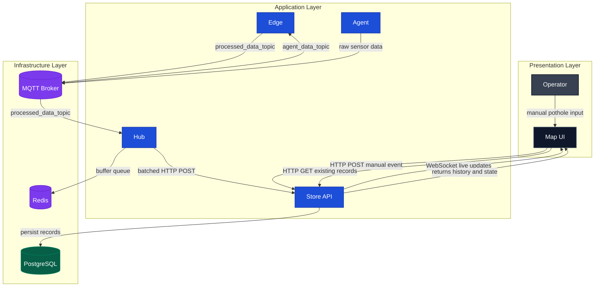

# Road Vision Architecture

## Goal

Система складається з кількох сервісів, які разом вирішують дві задачі:

1. автоматично виявляти дефекти дорожнього покриття з сенсорних даних;
2. дозволяти оператору вручну додавати дефекти на карті та одразу бачити їх у спільному інтерфейсі.

Після останніх змін цільова архітектура побудована навколо принципу:

`Store` є єдиним джерелом істини для всіх дорожніх подій, які відображаються на мапі.

## Main Components

### `road_vision_agent`

Генерує або читає сирі дані сенсорів:

- акселерометр
- GPS
- timestamp

Публікує їх у MQTT topic `agent_data_topic`.

### `road_vision_edge`

Виконує первинну обробку сирих даних:

- підписується на `agent_data_topic`
- класифікує стан дороги (`pothole` або `normal`)
- публікує оброблену подію у `processed_data_topic`

Це edge-рівень, де відбувається базова аналітика поблизу джерела даних.

### `road_vision_hub`

Виконує інтеграційну та буферизуючу роль:

- читає оброблені події з `processed_data_topic`
- тимчасово накопичує їх у Redis
- формує батчі
- відправляє батчі у `Store` через HTTP API

`Hub` ізолює `Store` від прямого потоку MQTT-повідомлень і дає місце для подальших інтеграцій, черг, ретраїв або enrichment-логіки.

### `road_vision_store`

Центральний бекенд і джерело істини системи:

- приймає оброблені дані від `Hub`
- приймає ручно створені дефекти від `MapUI`
- розраховує `repair_cost` для ручних кейсів, де є `dimensions`
- зберігає все в PostgreSQL
- віддає історичні дані через REST
- пушить live-оновлення через WebSocket

Саме `Store` визначає, що існує в системі як валідна дорожня подія.

### `road_vision_map`

Клієнтський UI для оператора:

- завантажує історичні записи зі `Store`
- слухає live-події через WebSocket
- дозволяє вручну додавати яму через UI
- відображає бюджет на основі записів, що прийшли зі `Store`

`MapUI` більше не є місцем істини для даних. Він тільки показує і ініціює дії.

## High-Level Diagram

Нижче схема в більш професійному вигляді, яку зручно показувати на демо або захисті.

## Core Principle

### Single Source of Truth

До переробки ручне додавання ям у `MapUI` ішло через локальну UI-логіку та MQTT-обхідний шлях. Це створювало розрив між тим:

- що бачить користувач на карті;
- що реально зберігається в системі;
- що проходить через бекендовий пайплайн.

Тепер це вирівняно:

- будь-яка валідна подія має пройти через `Store`;
- `Store` вирішує, що зберігається в БД;
- `MapUI` лише відображає те, що повертає або транслює `Store`.

## Main Data Flows

### 1. Automatic Detection Flow

Використовується для сенсорних подій:

1. `Agent` публікує сирі сенсорні дані в MQTT.
2. `Edge` читає їх і класифікує стан дороги.
3. `Edge` публікує оброблену подію в `processed_data_topic`.
4. `Hub` читає повідомлення, кладе їх у Redis і формує батч.
5. `Hub` відправляє батч у `Store`.
6. `Store` зберігає записи в PostgreSQL.
7. `Store` транслює WebSocket подію для всіх `MapUI` клієнтів.
8. `MapUI` оновлює карту.

### 2. Manual Add Flow

Використовується для операторського додавання ями:

1. Оператор у `MapUI` натискає `Додати яму`.
2. Оператор клікає по карті та вводить `road_state`, `length`, `width`, `depth`.
3. `MapUI` відправляє HTTP POST у `Store`.
4. `Store`:
   - валідує payload;
   - обчислює `repair_cost`;
   - зберігає подію в PostgreSQL;
   - маркує її як `source = manual`;
   - розсилає WebSocket подію.
5. Усі відкриті клієнти `MapUI` бачать нову яму на карті.

### 3. Initial Load Flow

При запуску `MapUI`:

1. `MapUI` робить `GET /processed_agent_data/`.
2. `Store` повертає поточний список записів.
3. Карта будується на основі вже збережених даних.
4. Далі `MapUI` переходить у live-режим через WebSocket.

## Store Data Model

У `Store` таблиця `processed_agent_data` після переробки покриває обидва типи подій:

- сенсорні події
- ручно створені події

Основні поля:

- `id`
- `road_state`
- `source`
- `x`, `y`, `z`
- `latitude`, `longitude`
- `timestamp`
- `length`, `width`, `depth`
- `repair_cost`

Логіка:

- для автоматичних подій `source = sensor`, а `dimensions` і `repair_cost` можуть бути `NULL`;
- для ручних подій `source = manual`, а `dimensions` і `repair_cost` заповнюються.

## Responsibility Boundaries

### Agent

Відповідає лише за генерацію сирих подій.

### Edge

Відповідає лише за доменну класифікацію сирих даних.

### Hub

Відповідає лише за транспорт, буферизацію, батчинг і інтеграцію.

### Store

Відповідає за:

- збереження
- серверну валідацію
- серверні обчислення
- публікацію оновлень
- читання історії

### MapUI

Відповідає лише за UX і візуалізацію.

## Why This Architecture Is Better

### 1. Consistency

Те, що бачить користувач, збігається з тим, що збережено у БД.

### 2. Extensibility

У майбутньому можна безболісно додати:

- авторизацію операторів
- audit trail
- підтвердження або модерацію ручних подій
- окремі типи дефектів
- складніший розрахунок вартості

### 3. Multi-client Support

Оскільки live-оновлення йдуть зі `Store`, кілька відкритих карт побачать однаковий стан системи.

### 4. Better Separation of Concerns

Обчислення, збереження і відображення більше не змішані в одному UI-клієнті.

## Recommended Next Steps

Що логічно зробити далі, якщо розвивати систему:

1. Додати окрему сутність `defect_type` замість вільного `road_state`.
2. Додати `DELETE` або soft delete для ручних маркерів через UI.
3. Додати окремий endpoint для manual events, якщо потрібен чіткий контракт.
4. Винести формулу `repair_cost` у доменний сервіс або окремий модуль.
5. Додати міграції БД замість `ALTER TABLE IF NOT EXISTS` на старті.
6. Додати тести для `Store` на manual flow і WebSocket events.

## Final Architecture Summary

Канонічний потік системи тепер такий:

- автоматичні події:
  `Agent -> Edge -> Hub -> Store -> WebSocket -> MapUI`

- ручні події:
  `MapUI -> Store -> WebSocket -> MapUI`

Отже, `MapUI` став клієнтом, `Store` став центром даних, а вся система отримала простішу та більш правильну архітектуру.
