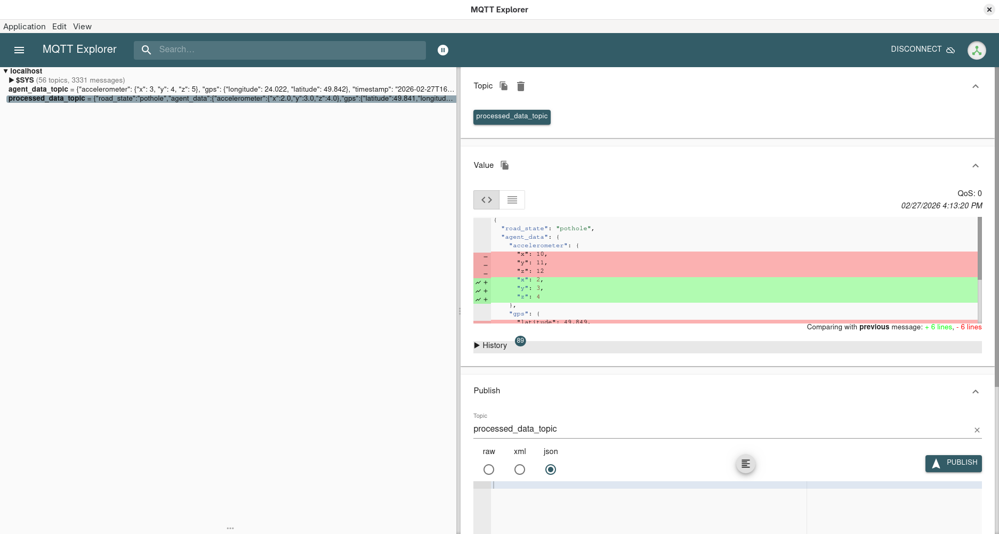
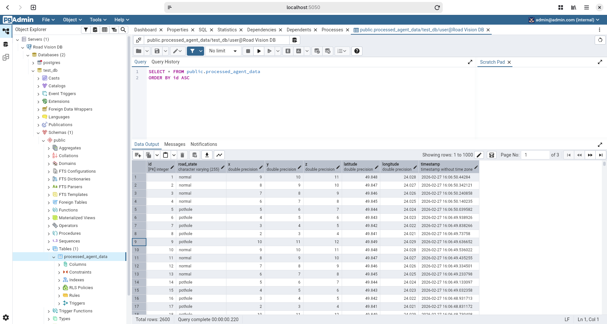

# Лабораторна робота №4: Edge Data Logic
## Мета роботи
Реалізувати модуль Edge Data Logic для комплексної системи моніторингу стану дорожнього покриття. Цей модуль відповідає за логіку збору "сирих" даних з MQTT-брокера від агента (автомобіля), первинний аналіз стану дорожнього покриття (визначення ям) та відправку проаналізованих даних на Hub.

### 1.Реалізація ключових компонентів
Згідно із завданням, було реалізовано наступні компоненти для обробки та передачі даних.

### 2.Логіка обробки даних (data_processing.py)
Функція аналізує дані з акселерометра і класифікує стан дороги. Нерівності (ями) визначаються за відхиленням значень по осі Z від стану спокою (діапазон від 6.0 до 11.0 вважається нормою).

```python
from app.entities.agent_data import AgentData
from app.entities.processed_agent_data import ProcessedAgentData

def process_agent_data(agent_data: AgentData) -> ProcessedAgentData:
    """
    Process agent data and classify the state of the road surface.
    """
    z_value = agent_data.accelerometer.z
    
    if z_value > 11.0 or z_value < 6.0: 
        road_state = "pothole"
    else:
        road_state = "normal"
        
    return ProcessedAgentData(
        road_state=road_state,
        agent_data=agent_data
    )
```

### 3. Адаптер підключення агента (agent_mqtt_adapter.py)
Отримує дані від сенсорів з топіка agent_data_topic, конвертує їх з JSON у Pydantic-модель, передає на обробку та надсилає результат до Hub Gateway.

```python
import logging
import paho.mqtt.client as mqtt
from app.interfaces.agent_gateway import AgentGateway
from app.interfaces.hub_gateway import HubGateway
from app.entities.agent_data import AgentData
from app.usecases.data_processing import process_agent_data

class AgentMQTTAdapter(AgentGateway):
    def __init__(self, broker_host: str, broker_port: int, topic: str, hub_gateway: HubGateway):
        self.broker_host = broker_host
        self.broker_port = broker_port
        self.topic = topic
        self.hub_gateway = hub_gateway
        self.client = mqtt.Client()
        self.client.on_connect = self.on_connect
        self.client.on_message = self.on_message

    def on_connect(self, client, userdata, flags, rc):
        if rc == 0:
            logging.info(f"Connected to Agent MQTT Broker")
            self.client.subscribe(self.topic)

    def on_message(self, client, userdata, msg):
        try:
            payload = msg.payload.decode("utf-8")
            agent_data = AgentData.model_validate_json(payload, strict=True)
            processed_data = process_agent_data(agent_data)
            self.hub_gateway.save_data(processed_data)
        except Exception as e:
            logging.error(f"Error processing message from Agent: {e}")

    def connect(self):
        try:
            self.client.connect(self.broker_host, self.broker_port, 60)
        except Exception as e:
            logging.error(f"Could not connect to Agent MQTT broker: {e}")

    def start(self):
        self.client.loop_start()

    def stop(self):
        self.client.loop_stop()
        self.client.disconnect()
```

### 4. Адаптер підключення Hub (hub_mqtt_adapter.py)
Приймає оброблені дані та публікує їх у топік processed_data_topic, звідки їх забирає Hub для подальшого збереження у базу даних.

```python
import logging
import paho.mqtt.client as mqtt
from app.interfaces.hub_gateway import HubGateway
from app.entities.processed_agent_data import ProcessedAgentData

class HubMqttAdapter(HubGateway):
    def __init__(self, broker: str, port: int, topic: str):
        self.broker = broker
        self.port = port
        self.topic = topic
        self.client = mqtt.Client()
        self.connect_to_broker()

    def connect_to_broker(self):
        try:
            self.client.connect(self.broker, self.port, 60)
            self.client.loop_start()
        except Exception as e:
            logging.error(f"Could not connect to Hub MQTT broker: {e}")

    def save_data(self, processed_data: ProcessedAgentData) -> bool:
        try:
            payload = processed_data.model_dump_json()
            result = self.client.publish(self.topic, payload)
            if result[0] == 0:
                logging.info(f"Published processed data to {self.topic}")
                return True
            return False
        except Exception as e:
            logging.error(f"Error publishing to Hub MQTT: {e}")
            return False
```

## 5. Перевірка працездатності
Проєкт запускається в ізольованому середовищі за допомогою команди docker-compose up --build.
### 6. Результати в MQTT Explorer


На скриншоті видно підписку на топіки agent_data_topic та processed_data_topic, а також валідне JSON-повідомлення зі статусом road_state.

### 7. Результати збереження в БД (PgAdmin)


На скриншоті видно створену таблицю processed_agent_data, яка заповнюється подіями з відповідними класифікаціями (pothole/normal) та часовими мітками.

## 8. Висновки
В ході виконання лабораторної роботи було успішно створено модуль Edge Data Logic, який виконує роль проміжного ланцюга для первинної обробки даних на "краю" мережі (Edge Computing).Було вирішено проблеми із взаємодією мікросервісів у Docker-середовищі, налаштовано єдиний стандарт передачі часу (timestamp) між усіма компонентами та виправлено логіку бази даних. Система довела свою здатність у реальному часі отримувати сирі телеметричні дані, класифікувати стан дорожнього покриття на основі показань акселерометра та стабільно передавати результати для довготривалого зберігання.
