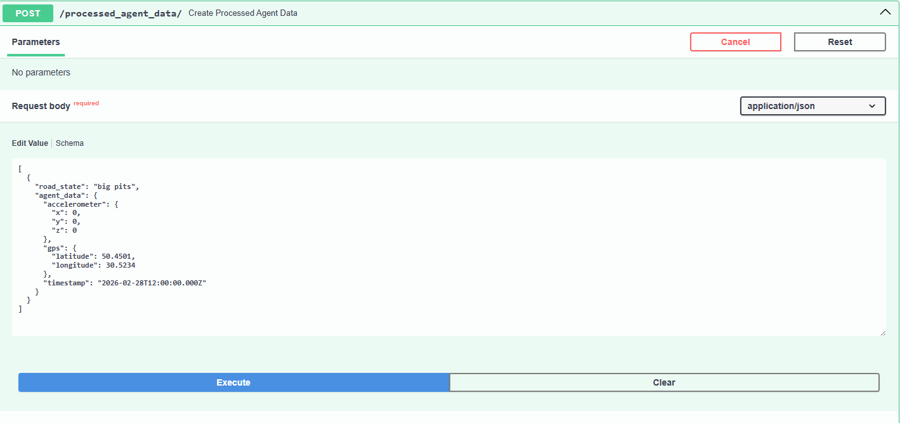
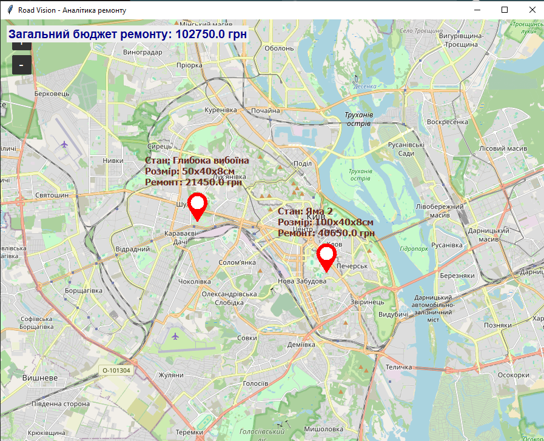

# Agent для моніторингу стану дорожнього покриття

## Опис

Даний проєкт є реалізацією Agent частини системи моніторингу стану
дорожнього покриття.

Agent імітує роботу сенсорів автомобіля, читаючи дані з CSV файлів, та
відправляє їх у MQTT broker у форматі JSON.

Дані сенсорів включають:

-   акселерометр (x, y, z)
-   GPS координати (longitude, latitude)
-   час отримання даних

Agent працює безперервно та відправляє дані з заданим інтервалом.

------------------------------------------------------------------------

## Архітектура

CSV файли → FileDatasource → Domain Model → JSON → MQTT Broker

------------------------------------------------------------------------

## Структура проєкту

src/ - main.py --- основний файл запуску - config.py --- конфігурація
MQTT - file_datasource.py --- читання CSV - domain/ --- доменні моделі -
schema/ --- схеми JSON - data/ --- CSV файли

docker/ - docker-compose.yaml - mosquitto/

Dockerfile\
requirements.txt\
README.md

------------------------------------------------------------------------

## Реалізація FileDatasource

FileDatasource відповідає за читання даних з CSV файлів.

Основні методи:

### startReading()

Відкриває CSV файли та створює CSV reader.

### read()

Виконує:

-   читає наступний рядок accelerometer.csv
-   читає наступний рядок gps.csv
-   створює об'єкт Accelerometer
-   створює об'єкт Gps
-   створює об'єкт AggregatedData
-   повертає AggregatedData

AggregatedData містить:

-   accelerometer
-   gps
-   time

Після цього дані відправляються через MQTT.

### stopReading()

Закриває CSV файли та звільняє ресурси.

------------------------------------------------------------------------

## Нескінченне читання

Реалізовано нескінченний цикл читання.

Після досягнення кінця файлу читання починається з початку.

Це дозволяє Agent працювати без зупинки.

------------------------------------------------------------------------

## MQTT

Дані відправляються у topic:

agent_data_topic

Формат повідомлення:

{ "accelerometer": { "x": 1, "y": 2, "z": 3 }, "gps": { "longitude":
24.02, "latitude": 49.84 }, "time": "2026-01-01T12:00:00" }

------------------------------------------------------------------------

## Запуск

Використовується Docker.

Команди:

cd docker

docker compose up --build

------------------------------------------------------------------------

## Перевірка

Використати MQTT Explorer.

Host: localhost\
Port: 1883\
Topic: agent_data_topic

------------------------------------------------------------------------

Було реалізовано Agent, який читає дані сенсорів з CSV файлів та
відправляє їх у MQTT broker.

Було реалізовано клас FileDatasource для роботи з даними.

Agent працює безперервно та успішно передає дані.

# Hub для моніторингу стану дорожнього покриття

## Опис
Даний проєкт є реалізацією **Hub** частини системи моніторингу стану дорожнього покриття.

Hub виконує роль проміжного мікросервісу, який акумулює дані від Agent або Edge Data Logic, тимчасово зберігає їх у пам'яті (Redis) для формування пакетів (батчів), та відправляє оброблені пакети даних до бази даних через Store API.

Hub може отримувати проаналізовані дані двома шляхами:
* Через **MQTT брокер**
* Через **HTTP POST запити**

**Дані включають:**
* Стан дороги (`road_state`: "small pits", "normal", тощо)
* Дані акселерометра (`x`, `y`, `z`)
* GPS координати (`longitude`, `latitude`)
* Час отримання даних

---

## Архітектура
`Agent / Edge Logic` → `MQTT / HTTP` → `FastAPI (Hub)` → `Redis (тимчасовий кеш)` → `StoreApiAdapter (HTTP POST)` → `Store API (PostgreSQL)`

---

## Структура проєкту
* `app/adapters/store_api_adapter.py` — адаптер для відправки HTTP запитів до Store API
* `app/entities/` — доменні моделі (Pydantic схеми для валідації JSON)
* `app/interfaces/store_gateway.py` — інтерфейс для взаємодії зі Store
* `docker/docker-compose.yaml` — конфігурація для розгортання Hub, Redis, Mosquitto та Store
* `docker/Dockerfile` — інструкція збірки образу для Hub
* `main.py` — основний файл запуску (FastAPI та MQTT клієнт)
* `config.py` — конфігурація середовища (змінні оточення)
* `requirements.txt` — залежності проєкту
* `README.md` — опис проєкту

---

## Реалізація Hub логіки
Hub відповідає за прийом, кешування та пакетну передачу даних.

### Основні процеси:

1. **Накопичення даних (Redis)**
При отриманні даних (через MQTT або HTTP), Hub валідує їх за допомогою Pydantic моделі `ProcessedAgentData` та додає у чергу Redis за допомогою команди `lpush`.

2. **Пакетна відправка (Batching)**
Після кожного додавання запису перевіряється довжина черги `redis_client.llen()`. Якщо кількість записів досягає значення `BATCH_SIZE` (задається в конфігурації), Hub:
* витягує задану кількість записів з Redis (`lpop`)
* формує масив об'єктів
* викликає метод `save_data` у `StoreApiAdapter`

3. **StoreApiAdapter**
Реалізує інтерфейс `StoreGateway`. Перетворює масив Pydantic об'єктів у JSON та виконує HTTP POST запит до мікросервісу Store для збереження даних у PostgreSQL.

---

## Інтеграція протоколів (MQTT та HTTP)

### HTTP (FastAPI)
Ендпоінт для отримання даних: `POST /processed_agent_data/`

### MQTT (Mosquitto)
Hub підписаний на topic: `processed_data_topic`

**Формат повідомлення (JSON):**
```json
{
  "road_state": "small pits",
  "agent_data": {
    "accelerometer": {
      "x": 1.2,
      "y": 0.5,
      "z": 9.8
    },
    "gps": {
      "latitude": 50.4504,
      "longitude": 30.5245
    },
    "timestamp": "2026-02-27T12:00:00Z"
  }
}
```
### Запуск
Використовується **Docker**. Конфігурація піднімає одразу весь ланцюг мікросервісів: **Mosquitto**, **Redis**, **PostgreSQL**, **pgAdmin**, а також модулі **Store** та **Hub**.

**Команди:**
bash
cd docker
docker-compose up --build
Перевірка
Переконатися в працездатності можна декількома способами:

Відправка даних:

Через Swagger UI Hub-а: http://localhost:9000/docs

Через MQTT Explorer (Host: localhost, Port: 1883, Topic: processed_data_topic)

Перевірка збереження:

Через Swagger UI Store-а: http://localhost:8000/docs (GET запит)

Через pgAdmin: http://localhost:5050 (Таблиця processed_agent_data у БД test_db)

Висновок
Було реалізовано мікросервіс Hub, який приймає проаналізовані дані сенсорів через MQTT та HTTP.

Було реалізовано механізм тимчасового накопичення даних за допомогою Redis та їх пакетної відправки.

Hub успішно інтегрований з мікросервісом Store та працює у спільному Docker-середовищі.

# Edge Data Logic

## Мета роботи
Реалізація модуля **Edge Data Logic** для комплексної системи моніторингу дорожнього покриття. Модуль забезпечує збір "сирих" даних від Агента, їх класифікацію та передачу оброблених результатів на Hub.

---

## Ключові компоненти

### 1. Логіка обробки даних (`data_processing.py`)
Алгоритм аналізує показники акселерометра по осі **Z**. Відхилення значень за межі діапазону **6.0 – 11.0** класифікується як `pothole` (вибоїна), інакше стан дороги вважається `normal`.

### 2. Адаптер Агента (`agent_mqtt_adapter.py`)
- Підписується на топік `agent_data_topic`.
- Конвертує JSON у Pydantic-моделі для валідації.
- Передає дані на обробку та надсилає результат у Hub Gateway.

### 3. Адаптер Hub (`hub_mqtt_adapter.py`)
Забезпечує публікацію оброблених даних у топік `processed_data_topic`, звідки вони зчитуються Hub-ом для збереження в базу даних.

---

## Перевірка працездатності

### Запуск системи
Проєкт запускається в ізольованому Docker-середовищі:
```bash
docker-compose up --build
```
## Моніторинг результатів
MQTT Explorer: Підтверджує наявність валідних JSON-повідомлень у топіках agent_data_topic та processed_data_topic.

PgAdmin: Демонструє заповнення таблиці processed_agent_data записами з відповідною класифікацією стану дороги.


# MapUI: Модуль візуалізації стану дорожнього покриття

## Опис

Даний проєкт є реалізацією MapUI частини комплексної системи моніторингу стану дорожнього покриття. 

Модуль призначений для візуального відображення даних про стан дороги на інтерактивній географічній карті. Він дозволяє оператору в режимі реального часу відстежувати проблемні ділянки (ями, тріщини тощо), що виявляються системою під час руху автомобілів.

Модуль може працювати у двох режимах:
1. Автономне читання даних з локального CSV-файлу (емуляція датчиків).
2. Отримання проаналізованих даних від серверного модуля `Store` у реальному часі через протокол WebSocket.

---

## Архітектура

**Real-time режим:**
Store API (WebSocket) → MapUI (Python Клієнт) → TkinterMapView (Візуалізація)

**Автономний режим:**
CSV файл → FileDatasource → TkinterMapView (Візуалізація)

---

## Структура проєкту

`road_vision_map/`
  - `main.py` — основний файл запуску додатку (UI та WebSocket-клієнт).
  - `file_datasource.py` — модуль для читання локальних даних з CSV файлів.
  - `requirements.txt` — залежності проєкту.
  - `README.md` — документація проєкту.

---

## Реалізація FileDatasource

`FileDatasource` відповідає за читання даних з CSV файлу для емуляції та тестування інтерфейсу без підключення до серверної частини (бекенду).

Основні методи:
- `start_reading()` — відкриває CSV файл та створює об'єкт reader.
- `read()` — читає та повертає наступний рядок з координатами та станом дороги.
- `stop_reading()` — закриває файл та звільняє системні ресурси.

---

## Візуалізація та Інтеграція зі Store

Головний користувацький інтерфейс побудований на базі бібліотек `tkinter` та `tkintermapview`.
- Карта відображає маркери за отриманими географічними координатами (latitude, longitude).
- Колір маркера динамічно змінюється залежно від поля `road_state`: червоний колір сигналізує про дефекти (ями, вибоїни), зелений — про нормальний стан дороги.

Зв'язок із модулем `Store` реалізовано за допомогою асинхронного клієнта (`websockets`), який підключається до ендпоінту `ws://127.0.0.1:8000/ws/`. Програма встановлює постійне з'єднання та миттєво оновлює карту при надходженні нових подій про стан дороги.

---
**1. Відправка тестового POST-запиту через Swagger (емуляція виявлення дефекту):**



**2. Миттєве відображення результату на карті (MapUI):**



## Запуск

Оскільки модуль містить графічний інтерфейс користувача (GUI), він запускається локально у віртуальному середовищі комп'ютера, а не в Docker-контейнері. 

Перед запуском переконайтеся, що бекенд (`road_vision_store` та база даних) успішно запущений через `docker-compose`.


## Математична модель розрахунку
Вартість ремонту кожної точки розраховується за авторською формулою:
`Вартість = (Base + Volume * MaterialPrice) * Difficulty`
Де:
- **Base (1500 грн):** Фіксовані витрати на виїзд бригади, підготовку ділянки та фрезерування.
- **Volume:** Об'єм ями у кубічних сантиметрах (L x W x D).
- **MaterialPrice (0.8 грн/см³):** Вартість асфальтобетонної суміші та її укладки.
- **Difficulty (коефіцієнт 1.5):** Застосовується автоматично, якщо глибина ями перевищує 5 см, що потребує пошарового зміцнення полотна.

## Інструкція з розгортання та запуску

### 1. Підготовка інфраструктури (Docker)
Для коректної роботи системи необхідно запустити спільні сервіси (базу даних PostgreSQL, MQTT-брокер Mosquitto та Store API). Перейдіть у кореневу папку проекту `road_vision_store/docker` та виконайте команду:
`docker-compose up --build`

### 2. Налаштування клієнтського модуля
Встановіть залежності: `pip install -r requirements.txt`

### 3. Запуск застосунку
Запустіть головний скрипт візуалізації:
`python main.py`

## Тестування та верифікація
Для перевірки роботи модуля без використання реального Агента можна скористатися утилітою **MQTT Explorer**. Підключіться до `localhost:1883` та відправте у топік `agent_data_topic` наступний JSON-пакет:
```json
{
  "gps": {"latitude": 50.4485, "longitude": 30.4570},
  "road_state": "Pothole",
  "dimensions": {
    "length": 45,
    "width": 35,
    "depth": 7
  }
}

